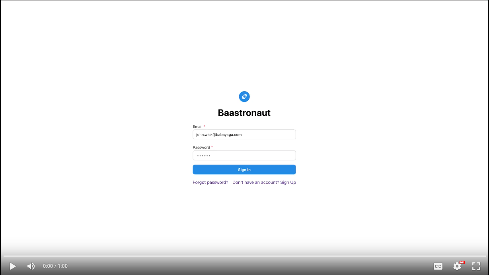

# Baastronaut

  <b>
  Combining ease of spreadsheet-like UI and flexibility of GraphQL-like REST APIs. Powered by PostgREST.
  </b>

Baastronaut - Backend-as-a-Service Astronaut - is an open-source Airtable alternative. It is built on PostgREST and hence, Postgres. The web-based app frontend and spreadsheet-like UI makes it easy for non-technical users to create spreadsheets and add data, while the flexible and comprehensive REST APIs give developers a powerful toolset to work with.

  

  Baastronaut demo video

## Status
- [x] **An MVP that we are thoroughly embarrassed about**: It works, at least on my machine, I promise! Not for production uses.
- [ ] **Alpha**: Easy to setup, all the basic features to use with a team.
- [ ] **Beta**: Feature-rich and stable. Cloud version is also ready.
- [ ] **Public**: General Availability.

## Components
- [baastronaut-be](baastronaut-be) is the backend for this project.
- [baastronaut-fe](baastronaut-fe) is the frontend for this project.

### Setup
Refer to the README in each component's folder for instructions on running them and/or technical details. We are still in the early stages and are still working on simplifying the setup process with a script.

To see the app working end-to-end, you need these components running:

1. Baastronaut Frontend
2. Baastronaut Backend
3. PostgREST instance
4. Postgres database - you need 2 Postgres databases (but they can be on the same server instance).

The [backend design doc](./be-design.md) provides a detailed explanation of our design choice and how user projects and spreadsheets map to Postgres objects.

## Features
- [x] Create spreadsheets with basic data types.
- [x] Insert/edit/delete data in spreadsheets.
- [x] Auto-generated REST APIs and documentation.
- [ ] Team invites and roles (editors, collaborators)
- [ ] Access control
- [ ] Fuzzy searching using FTS
- [ ] Webhooks

## Support
Please file any bugs, feature requests, or questions using [Github Issues](https://github.com/baastronaut/baastronaut/issues).