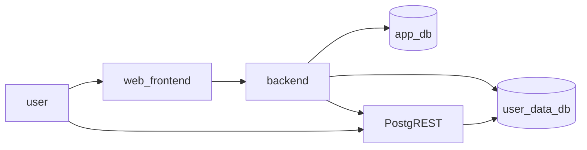

# Backend Architecture Design

[PostgREST](https://postgrest.org/en/stable/) is an open-source web server that can provide REST APIs for any Postgres database out-of-the-box.

We need 2 databases - 1 for our app data and 1 for users' data. PostgREST server would point to the users' data database and serve REST APIs from it directly.

The following mappings apply:
| User | Application |
|-------| ----|
|Project|Postgres Schema|
|Table|Postgres Table|
|Column|Postgres Column|

1. When user creates a Project, we create a Postgres Schema in `user_data_db`.
2. When user creates a Table in a Project, we create a Postgres Table in the corresponding Schema in `user_data_db`.
3. When user creates a a Column in a Table, we create a Postgres Column in the corresponding Table in `user_data_db`.

App Server will need to:

1. Handle these mappings.
2. Hardening the security for these schemas.
3. Creating Postgres roles that have access to them and generating JWT tokens that can be used to access the REST APIs for these data via PostgREST.
4. Storing mappings, roles, tokens in `app_db`.

With this setup, that means we are using a single `user_data_db` for all users' data, i.e. users from totally different teams are using the same database. Therefore, it is critical that the app server hardens the schemas and create the roles correctly to prevent users from a different team accessing data from another team.